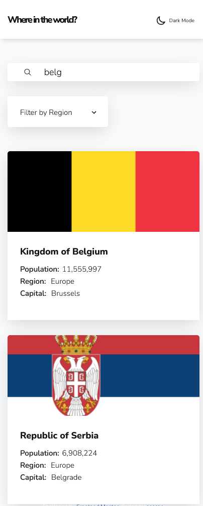

# Frontend Mentor - REST Countries API with color theme switcher solution

This is a solution to the [REST Countries API with color theme switcher challenge on Frontend Mentor](https://www.frontendmentor.io/challenges/rest-countries-api-with-color-theme-switcher-5cacc469fec04111f7b848ca). Frontend Mentor challenges help you improve your coding skills by building realistic projects.

## Table of contents

-   [Overview](#overview)
    -   [The challenge](#the-challenge)
    -   [Screenshot](#screenshot)
    -   [Links](#links)
-   [My process](#my-process)
    -   [Built with](#built-with)
    -   [Continued development](#continued-development)
    -   [Useful resources](#useful-resources)
-   [Author](#author)

## Overview

### The challenge

Users should be able to:

-   See all countries from the API on the homepage
-   Search for a country using an `input` field
-   Filter countries by region
-   Click on a country to see more detailed information on a separate page
-   Click through to the border countries on the detail page
-   Toggle the color scheme between light and dark mode _(optional)_

### Screenshot

### Links

-   Solution URL: [Github Repository](https://github.com/iskandar13abdurakhmonov/countries)
-   Live Site URL: [Netlify Live Server](https://master--unrivaled-dolphin-171916.netlify.app/)

## My process

### Built with

-   Semantic HTML5 markup
-   CSS custom properties
-   Flexbox
-   CSS Grid
-   [React](https://reactjs.org/) - JS library

### Continued development

In the future i want to wrap the app into the context and apply custom hooks for data fetching state

### Useful resources

-   [LogRocket](https://blog.logrocket.com/dark-mode-react-in-depth-guide/) - This helped me for implementing dark mode theme. I really liked this pattern and will use it going forward.

## Author

-   Frontend Mentor - [@eescan](https://www.frontendmentor.io/profile/eescan)
-   Twitter - [@ab65485](https://www.twitter.com/@ab65485)
